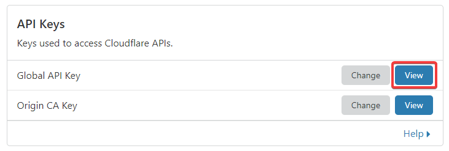

# Cloudflare DDNS

A simple tool that allows you to use Cloudflare as a ddns provider so that you can use any domain for free without having a static public ip address.

Before using the tool a configuration file must be created. To do this simply run the following commands:

```bash
chmod +x cloudflare-ddns

./cloudflare-ddns --configure
```

After starting the executable with the `--configure` parameter the configurator will ask you for your authentication email address and key. For authentication email use your Cloudflare account email. For authentication key use your global Cloudflare api key that can be viewed under My Profile / API Tokens.



After finishing the configuration you can add the binary to Crontab on Linux or to Task Scheduler in Windows to automate your domain updates.

Thanks to [@janunterkofler](https://github.com/janunterkofler) for the initial bash script!
